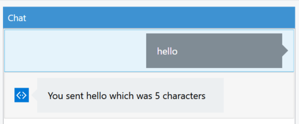
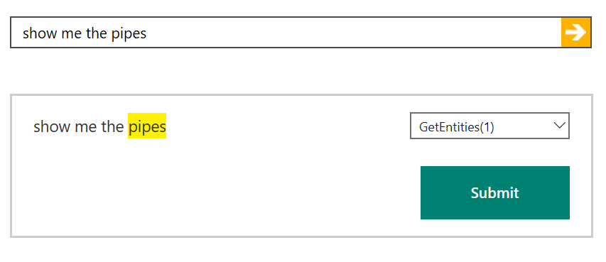
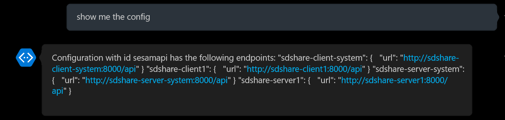
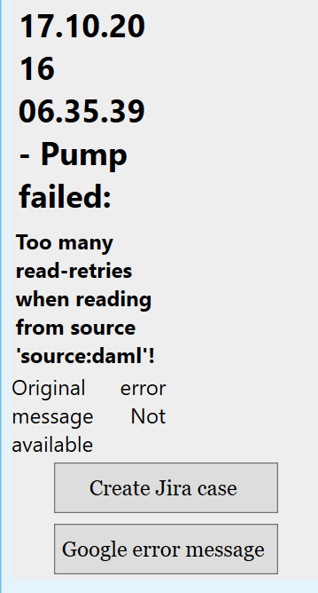

# SesamBot

SesamBot is a simple bot created using the [Microsoft Bot Framework](https://dev.botframework.com/) to query the Sesam API to get information about the Sesam node. 
The bot collects information from [Open Sesam](https://open.sesam.io), a Sesam installation open for the public, and the corresponding api endpoint at (https://open.sesam.io/api/api). 
Documentation for the Sesam api itself can be found [here](https://open.sesam.io/api/docs/api.html#api-reference).

The SesamBot uses [LUIS](https://luis.ai) to interpret the messages, check out the [video](https://www.luis.ai/Help/)  to get a quick introduction.

The SesamBot can be run both opn your local computer and in Azure. To run it locally it is recommended to install the [Bot Framework Channel Emulator](https://download.botframework.com/bf-v3/tools/emulator/publish.htm) to communicate with it.

##Introduction

At work this week our bosses decided that it was time for us to play some with the latest version of our product. I was given the task to look into what use [Sesam](https://sesam.io could have for bots, specifically for monitoring systems. Our first idea was to use it to query our Sesam nodes about system status, configuration and errors. This would give us a quick way to implement a client for our API that would be cross platform and a bit more user friendly then a command line tool, or displaying unformatted json in a browser.

##MS Bot Framework

Since my background is from  .net coding I started looking into the [Microsoft Bot Framework](https://dev.botframework.com/) and the [BotBuilder SDK ](https://github.com/Microsoft/BotBuilder/tree/master/CSharp) for C#. One of the advantages of the framework is that the bot that you write can be used in different channels such as Skype, Slack and Facebook messenger.

Using the Bot Application project template you start off with a bot that echoes the number of characters in the message you send to the bot.

This is perhaps not so useful, but at least it shows you how easy it is to get started with a bot that can be used in different channels.

##Sesam API

The bot should collect information from [Open Sesam](https://open.sesam.io), a Sesam installation open for the public, and the corresponding API endpoint at (https://open.sesam.io/api/api). The API can be used to get different properties about the system, such as configuration  or the state of a dataflow, or to start jobs, add/remove configuration or in short, almost everything returned json. Documentation for the Sesam API itself can be found [here](https://open.sesam.io/api/docs/api.html#api-reference). In this example we're going to limit the use of the API to fetch information from the Open Sesam API endpoint, specifically get the entities of some type such as:
- license
- pipes
- systems
- config
- datasets

Another possibility is to get a different event from a specific pipe such as when a pipe starts, stops or fails. The latter can be used to query for errors in a pipe.

##LUIS

Like it is described in the samples, I started with some simple switches to handle different cases of commands, but quickly realized that building this would lead to a gigantic tree of ifs and switches and changed to using [LUIS](http://luis.ai) to interpret messages to the bot. 

LUIS takes an utterance and maps it to an intent with the possibility to extract entities which you configure in your LUIS application, for example the utterance "give me the license information" in the SesamBot application would map to the intent "GetEntities" with the  entity "license".  To see a small example of LUIS in action you can try to import [SesamBot - first try.json](./LUIS/SesamBot - first try.json). This is a very small application, with only two utterances mapped ("give me systems info" and "give me the license info") and a phrase list containing the different entities you can get from the Sesam API (license, pipes, systems, config and datasets). Although this is a very small dataset LUIS now will map the utterance "show me the pipes" to the correct intent(GetEntities) and extract the correct entity (pipes).

##Tying it all together
So with the MS Bot Framework, LUIS and the Sesam API we now have all we need to try to get some information out of Sesam by sending a message to a Skype bot as shown in the screenshot below. 

Here we send the message through LUIS which finds the correct intent and entity, the bot then queries the Open Sesam API endpoint and returns the result in the Skype conversation.

We could also get all the errors that has occurred for the pipes and display them as a rich card with buttons to create a Jira case for the error or to google the error message.

##Testing out the demo
To try out the demo you will need to deploy the SesamBot to Azure. This can be done by following the steps [here](https://docs.botframework.com/en-us/csharp/builder/sdkreference/gettingstarted.html#publishing).

After you have done this you will need to update the web.config with the appropriate values for MicrosoftAppId and MicrosoftAppPassword and then your bot is ready to be deployed.

If you would like to create your own LUIS app or extend the exising one, the model for the LUIS app can be found in [SesamBot.json](./LUIS/SesamBot.json). If you do this remember to change the values of the id and subscription-key at the top of the [LUIS.cs](LUIS.cs) file

##Other possibilities
In order to add more useful functionality to the bot we could extend it so that the bot initiates a new conversation whenever a new error is found in the system, so that instead of just getting mail alerts when something happens (mail is one of the channels supported by the framework), you could choose if you also want a message in a Slack group or on Skype. This could of course be combined with the rich cards as shown in the error example.

Another possibility would be to let the bot do write operations to the Sesam API so that you could configure new systems and integrations from natural language.